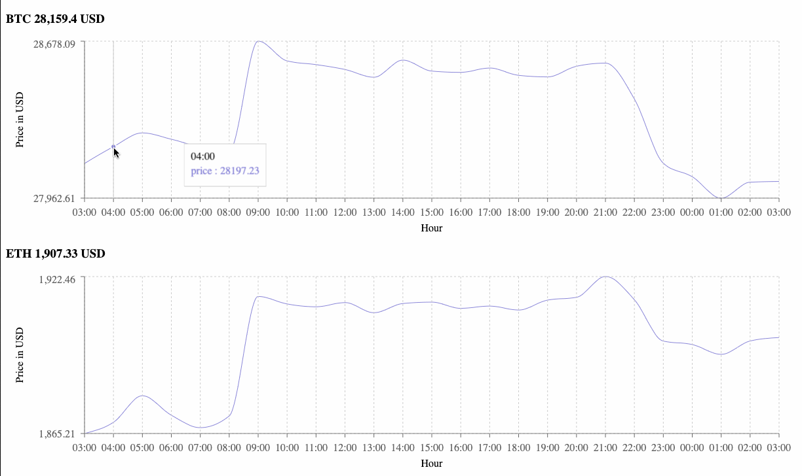

# Realtime Crypto Tracker

Write a simple and state-of-the-art web application which exposes the real time market data in USD for the two cryptocurrencies BTC and ETH for potential investors.

Investors additionally want to see how the market price has developed historically over the last 24 hours.

## Guidelines

- You are provided a 3rd party API that provides the market data.
- Make sure the code you deliver is what you would be comfortable deploying and maintaining **in production**!

## Market Data Provider

You are encouraged to get the real market data from the CryptoCompare 3rd party API.
Please find their API documentation [here](https://min-api.cryptocompare.com/documentation).

Here's an example to get the historical market price for a specified currency:

> https://min-api.cryptocompare.com/data/v2/histoday?fsym=BTC&tsym=USDC

You may need to generate a free api key

> https://www.cryptocompare.com/coins/guides/how-to-use-our-api/

## Demo

## Getting Started

- `yarn install`
- `yarn build`
- `yarn start`

## Run Tests

- `yarn test` Run alls test
- `yarn test web-app` Run frontend tests only
- `yarn test api-server` Run backend tests only

# Assumptions

"...exposes the real time market data in USD for the two cryptocurrencies BTC and ETH for potential investors."
By realtime I assume you mean "should update with the most up to date prices without need for page refresh"
For this I used https://min-api.cryptocompare.com/documentation/websockets
I assumed I need the aggregate index so I subscribe to `5~CCCAGG~BTC~USD` and `5~CCCAGG~ETH~USD`

"Investors additionally want to see how the market price has developed historically over the last 24 hours."
For this I used https://min-api.cryptocompare.com/documentation?key=Historical&cat=dataHistohour with a limit of 24 and took the `open` attribute for each hour
See `packages/api-server/src/utils/mapper-util.ts`

I assume that the api is for internal use only and there is 1 fullstack team for front and backend development. The frontend is tightly coupled to the backend, this will speed up development but will not scale well if there are multiple clients (or non Typescript clients)

# Decisions

Backend: I used https://trpc.io/ which allows you to easily build & consume fully typesafe APIs, without schemas or code generation

Frontend: I used Create React App because it is standard and simple to setup

I implemented the frontend and backend together a monoreposiry

## Advantages

- Shared config for tests, lint and typescript
- Developers should get better holistic view of the application and feel responsible for all parts (i.e: backend devs can more easily see if they are breaking frontend features and feel responsible for fixing those issues)
- Necessary for https://trpc.io/
- Backend and frontend developed in one repository means it's easier to go 'back in time' to previous app versions or create different versions

Note: This application has 1 dashboard screen for now. But for more screens I would use React Router

# Next steps

Docker file to containerize backend

Make things look pretty (e.g: Add MUI or other design system to frontend)

I didn't have time to write tests for `packages/api-server/src/routers/on-update-price.ts` but it would look very similar to `packages/api-server/src/routers/get-historical-price.test.ts`
